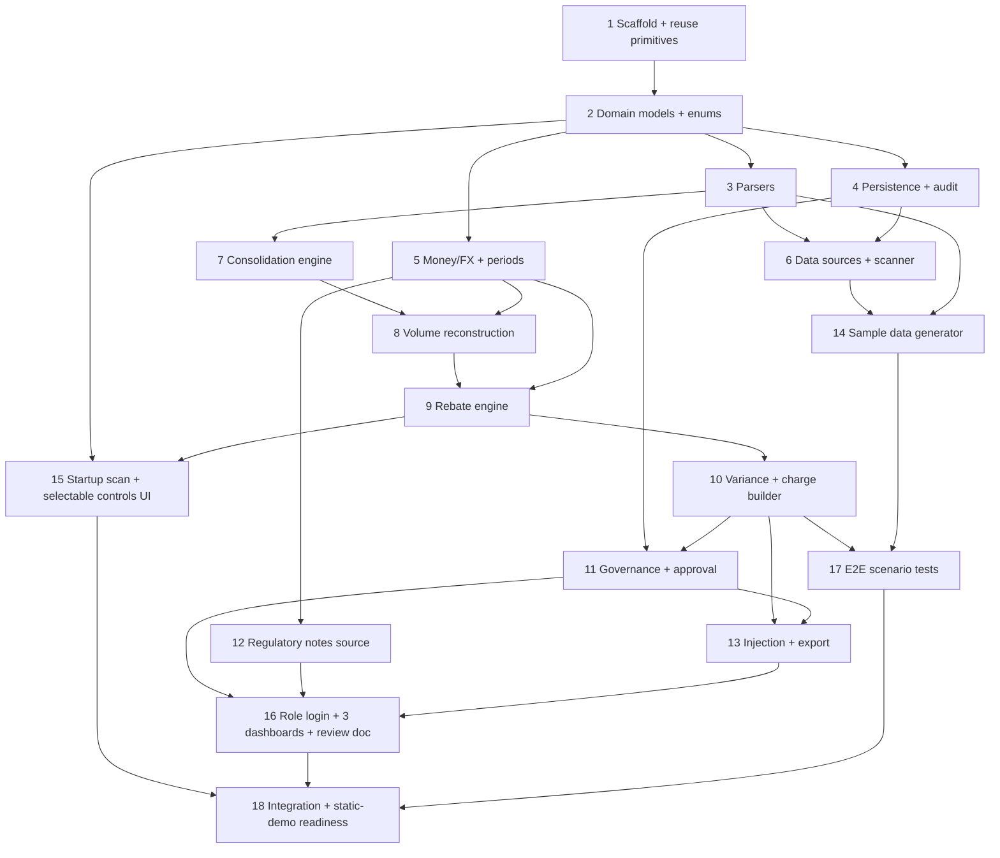

# Implementation Plan — VIR_Tier Recovery Engine

## Overview

Incremental, test-driven build of the VIR_Tier recovery sub-tool at `Perfumeries/VIR_Tier/build/`. Pure engines (parsers + reconstruction + rebate + variance + governance) are built and unit-tested before UI. Stack: vanilla JS + ES modules, no build step, static/GitHub-Pages friendly. Reuse is limited to proven primitives (`xml.js`, `csv.js`) and re-configured mechanisms (`StateStore`, audit primitive, i18n); all recovery domain logic is new. Each task lists the requirements it satisfies.

## Task Dependency Graph



Execution waves:

```json
{
  "waves": [
    { "wave": 1, "tasks": ["1"] },
    { "wave": 2, "tasks": ["2"] },
    { "wave": 3, "tasks": ["3", "4", "5"] },
    { "wave": 4, "tasks": ["6", "7", "12"] },
    { "wave": 5, "tasks": ["8"] },
    { "wave": 6, "tasks": ["9"] },
    { "wave": 7, "tasks": ["10"] },
    { "wave": 8, "tasks": ["11", "14"] },
    { "wave": 9, "tasks": ["13", "15"] },
    { "wave": 10, "tasks": ["16"] },
    { "wave": 11, "tasks": ["17"] },
    { "wave": 12, "tasks": ["18"] }
  ]
}
```

## Tasks

- [ ] 1. Scaffold and reuse proven primitives
  - Create `Perfumeries/VIR_Tier/build/` skeleton: `index.html`, `src/`, `src/lib/`, `src/ui/`, `tests/`, `data/inbox/{agreements,purchases,receipts,events,claimed}/`, `tools/`, and Node `--test` harness.
  - Copy proven primitives unchanged: `xml.js`, `csv.js`. Add `manifest.json` for static folder enumeration.
  - Confirm no secrets/credentials.
  - _Requirements: 10.1, 10.2, 10.5_

- [ ] 2. Domain models and enumerations
  - Implement factories/validators: Agreement (with tiers, currencies, countries, scope, retrospectiveReach, clauseRefs, incompleteFields), Purchase, Receipt (controlPeriod, optional vatTaxPoint), LeakageEvent, ClaimedCcogs, ReconstructedVolume, SupplementingCharge, AuditEntry.
  - Implement enums: Country, RebateStructure, Basis, Period, Scope, RetrospectiveReach, LeakageDriver, ChargeStatus, Role, ScanStatus, Currency.
  - _Requirements: 1.6, 2.4, 3.8_

- [ ] 3. Document parsers with provenance
- [ ] 3.1 Agreement parser (XML) — structure, tiers, basis, period, scope, retrospectiveReach, currencies, countries, clause refs; flag incomplete required config.
  - _Requirements: 1.1, 1.6, 3.8_
- [ ] 3.2 Purchase + Receipt parsers (CSV) — receipts derive controlPeriod; vatTaxPoint set only when present.
  - _Requirements: 1.1, 11.1, 11.3, 11.4_
- [ ] 3.3 Leakage event parser (CSV) — the five driver types with refs/dates.
  - _Requirements: 1.1, 2.7_
- [ ] 3.4 Claimed-CCOGS parser (CSV) — amount claimed per agreement/scope/period.
  - _Requirements: 1.1, 5.1_
- [ ] 3.5 Parse-error handling + round-trip tests — per-file try/catch with descriptive errors, continue on failure; `parse(serialize(parse(x))) ≡ parse(x)`.
  - _Requirements: 1.4, 1.1_

- [ ] 4. Persistence + audit primitive
  - Reconfigure `StateStore` collections for VIR_Tier entities (agreements, purchases, receipts, events, claimed, reconstructions, charges, audit); keep memory/localStorage backends.
  - Implement immutable append-only `audit.js` (appendAudit/auditLog); assert entries are never mutated.
  - _Requirements: 6.2, 6.4, 10.3, 10.4_

- [ ] 5. Money/FX and periods
- [ ] 5.1 `money.js` — `{value,currency}`; no implicit merge; EUR FX consolidation with recorded rate from bundled `fx_rates.json`; helper to decide when FX is required.
  - _Requirements: 4.1, 4.2, 4.3, 4.4, 4.5_
- [ ] 5.2 `periods.js` — month/quarter/year bucketing; `controlPeriod(date, period)`; VAT divergence flag when vatTaxPoint differs.
  - _Requirements: 11.1, 11.2, 11.5_

- [ ] 6. Data-source abstraction and startup scanner
  - `DataSource` interface; `DatabaseSource`/`ApiSource` return no-updates; `FolderSource` reads manifest + fetches inbox files. Ordered scanner (DB→API→Folder) emits status; on failure reports error and continues; hands files to consolidation.
  - _Requirements: 1.5, 1.4, 10.3, 10.4_

- [ ] 7. Consolidation engine
  - Ingest parsed records, tag each with Country, group per Supplier/Agreement across countries, attach provenance; surface incomplete-agreement flags.
  - Unit tests: cross-country grouping; provenance retained; incomplete flag.
  - _Requirements: 1.1, 1.2, 1.3, 1.6_

- [ ] 8. Volume reconstruction engine
  - Compute base volume per basis assigned to controlPeriod; apply the five driver corrections (return-rejection add-back, overage inclusion, backorder/late control-period attribution + flags, pan-EU aggregation); de-dup physical units; per-country vs pan-EU output; record every correction with volumeDelta.
  - Unit tests: each driver in isolation; de-dup (Property: no double count); pan-EU vs per-country; corrections captured for audit.
  - _Requirements: 2.1, 2.2, 2.3, 2.4, 2.5, 2.6, 2.7, 2.8, 11.1, 11.2_

- [ ] 9. Rebate engine
  - Pure `computeEntitled(reconstructedVolume, selections)` for all four structures; retrospective-tiered applies achieved rate to entire volume; sliding-incremental per band; flat; per-unit. Derive tier from qualifying volume. Retrospective reach: within-period vs prior-periods reopening. Read all config from agreement (no hard-coding). Recompute on selection change without re-ingestion.
  - Unit tests: four structures; retrospective entire-volume vs sliding per-band; within-period vs prior-period reopening; recompute idempotence.
  - _Requirements: 3.1, 3.2, 3.3, 3.4, 3.5, 3.6, 3.7, 3.8, 3.9_

- [ ] 10. Variance and supplementing-charge builder
  - `variance = entitled − claimed` per agreement/scope/period; when >0 build SupplementingCharge (PENDING_APPROVAL) with native + optional EUR amount, tier/structure/basis, clauseRef, and initial audit trace; when ≤0 record calculation only.
  - Unit tests: positive → charge; non-positive → none; currency + EUR equivalent; audit trace assembled.
  - _Requirements: 5.1, 5.2, 5.3, 5.4, 5.5_

- [ ] 11. Governance and approval workflow
  - Charge lifecycle PENDING_APPROVAL → APPROVED/REJECTED; assemble Finance_Approver review document (variance calc, reconstructed volume + corrections, source events + provenance, clause, audit trace); append immutable audit entry for every state change/recompute/FX application; block export/inject unless APPROVED.
  - Unit tests: status transitions; review-doc completeness; export/inject gating; append-only audit on recompute.
  - _Requirements: 6.1, 6.3, 6.5, 7.1, 7.2, 7.3, 7.4, 7.5_

- [ ] 12. Regulatory notes source
  - `regnotes.js` single map (CONTROL_PERIOD, VAT_TAX_POINT, and each LeakageDriver) → {short, regulation, sourceLabel}. Consumed by UI tooltips.
  - Unit test: every displayed driver/timing key has a note.
  - _Requirements: 12.1, 12.2, 12.3, 12.4_

- [ ] 13. Injection and export (show-first)
  - Display charges before any action; prompt export-or-inject; export approved charge + audit trace in a documented format; injection = state → INJECTED + exportable payload + hook for cloud posting; append audit entries.
  - Unit tests: show-before-action; export format; inject state + payload; gating on APPROVED.
  - _Requirements: 8.1, 8.2, 8.3, 8.4, 8.5_

- [ ] 14. Sample data generator
  - `tools/generate_samples.js` produces realistic SK/PL/CZ perfume-retail data proving: a pan-EU aggregation win, one case per leakage driver, a retrospective PRIOR_PERIODS reopening, a mixed-currency (PLN+EUR) value-basis FX case, and a zero/negative-variance control. Each with provenance and a claimed-CCOGS counterpart. Update `manifest.json`.
  - _Requirements: 1.1, 2.5, 3.9, 4.4, 5.3_

- [ ] 15. Startup scan + selectable controls UI
  - Three-source scan animation (DB/API no-updates → Folder live). Selectable controls (structure/basis/period/scope + view-all-in-EUR) wired to real-time rebate recompute.
  - _Requirements: 1.5, 3.5, 4.3_

- [ ] 16. Role login and three dashboards + review document
- [ ] 16.1 Client-side role login + routing (Analyst / Finance_Approver / Finance_Overview); real auth deferred to cloud.
  - _Requirements: 9.1, 9.5_
- [ ] 16.2 Views: Analyst (leakage by driver, reconstructed volume, tier determination, draft charges, live controls); Finance_Approver (approval queue + full review doc + approve/reject); Finance_Overview (recovery totals by supplier/country/period + drill-down + charts). Hover regulatory tooltips on timing/driver values. i18n EN/SK/PL/CZ.
  - _Requirements: 9.2, 9.3, 9.4, 12.1_

- [ ] 17. End-to-end scenario tests with the sample dataset
  - Wire scan → consolidate → reconstruct → rebate → variance → charge → approval → export/inject over the sample data. Assert: pan-EU win recovers the higher tier; each leakage driver restores volume; retrospective PRIOR_PERIODS reopening adds entitlement; mixed-currency value case uses FX and records the rate; zero/negative case yields no charge; export/inject blocked until approved.
  - _Requirements: 2.5, 3.6, 3.9, 4.4, 5.1, 5.2, 7.5_

- [ ] 18. Integration wiring and static-demo readiness
  - Compose scanner → consolidation → engines → store → UI end to end; verify it runs from a static host with manifest-based folder scan and no secrets; confirm independence from `Perfumeries/build/`.
  - _Requirements: 10.1, 10.2, 10.3, 10.5_

## Notes

- **Reuse boundary:** only `xml.js` and `csv.js` are copied verbatim; `StateStore`, the audit primitive, and the i18n mechanism are reused as mechanisms but re-configured; all recovery domain logic and UI are new (design "Reuse boundary").
- **Timing:** rebate volume follows transfer of control (`controlPeriod`); VAT tax point is a separate optional attribute, flagged on divergence (Req 11).
- **No hard-coding:** rebate structure, tiers, basis, period, scope, currencies, retrospective reach all come from agreement data (Req 3.8).
- **Static-host constraint:** GitHub Pages has no directory listing → `FolderSource` relies on `manifest.json`.
- **Testing:** engines are pure functions unit-tested in isolation; the sample dataset drives the E2E scenario in task 17.
- **Currencies:** SK→EUR, CZ→CZK, PL→PLN; agreements may carry two; EUR consolidation via bundled `fx_rates.json` (no secrets).
- Tasks are coding-only; each maps to requirements for traceability.
